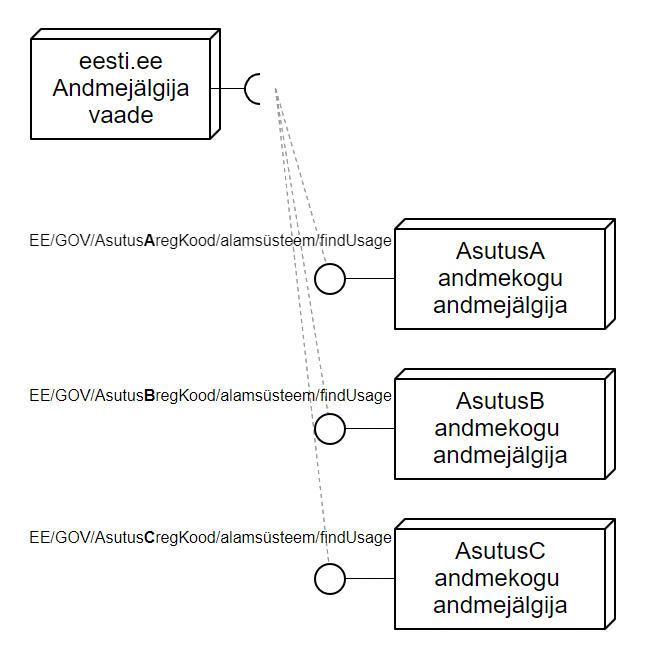

Andmejälgija / Data Tracker
=====================

### Andmejälgija üldine kirjeldus

Andmejälgija on inimesele suunatud teenus eesti.ee-s, mille eesmärgiks on tagada isikuandmete töötluse läbipaistvus avalikus sektoris. Andmejälgija toetub iga andmekogu võimekusele enda sees toimuvat andmetöötlust logide kujul talletada, et seda hiljem inimesele ehk andmesubjektile eesti.ee-s oleva teenuse kaudu kuvada. 

Arhitektuurselt on tegemist täielikult hajusa süsteemiga, st inimesele kuvatav info pärineb otse Andmejälgija teenuse realiseerinud andmekogust. Eesti.ee teeb kasutaja soovil päringu igasse Andmejälgija teenusesse ning kuvab päringuvastuse ilma salvestamata välja.

### Andmejälgijas kajastuv info

Andmejälgija peab inimesele kuvama infot nii andmekogus lokaalselt toimuvast andmetöötlusest (ametnike-töötajate tegevused isikuandmetega) kui ka ülevaadet sellest, kui andmeid on edastatud mõnele kolmandale osapoolele (üle X-tee teisele riigiasutusele, ettevõttele jm). 

Soovituslik on Andmejälgija funktsionaalsuse peale mõelda juba infosüsteemi projekteerides, arvestades vajadusega süsteemis toimuv andmetöötlus tulevikus inimeste jaoks läbipaistvaks ja arusaadavaks muuta. 

### Andmejälgija funktsionaalsuse loomine infosüsteemile või andmekogule
Oluline on esmalt luua andmekogus toimuvat andmetöötlust kajastav logi. 

Andmetöötlusfaktid (logid) tuleb teha publitseeritavaks X-teel. Selleks on kasutusel standardiseeritud teenus findUsage, mis võimaldab kuvada logi eesti.ee sektsioonis Andmejälgija. X-tee turvaserveris tuleb registreerida asutuse alamsüsteemi pakutav teenus (findUsage), mis väljastab andmejälgija kasutusteabe esitamise protokollile vastavalt logid. X-teel avatava [teenuse findUsage spetsifikatsioon](https://github.com/sipsu1/AJ/blob/master/doc/spetsifikatsioonid/Kasutusteabe_esitamise_protokoll.md). Liidestus tuleb teha REST päringu põhjal.

X-tee turvaserveris on vaja  ning teenus teha kättesaadavaks riigiportaalile, tunnus EE/GOV/70006317/riigiportaal-citizen

Andmejälgida teenuse kasutusele võtmisega seotud juriidilise infoga saad tutvuda [siin](https://github.com/sipsu1/AJ/blob/master/doc/Rakendusjuhend.md)

###  Andmetöötluslepingu sõlmimine RIA ning andmejälgijat kasutava asutuse vahel

Leping sõlmitakse RIA ja andmejälgija teenust pakkuva asutuse vahel.

* Andmejälgijaga liitumislepingu vormi leiad [siit](https://github.com/sipsu1/AJ/blob/master/doc/Andmej%C3%A4lgija%20liitumisleping%20p%C3%B5hi.docx).

###  Taotlus andmejälgija teenuse avamiseks riigiportaalis eesti.ee

Andmekogu omav asutus esitab eesti.ee-le taotluse teenuse avamiseks. Vajalik info:
* Teenuse nimi riigiportaalis (eesti, inglise ja vene keeles); kuvatakse kasutajale dropdown menüüs
* X-tee alamsüsteemi nimetus, mille vahendusel andmejälgija teenust pakutakse
* Teenuse sisulise omaniku kontaktandmed (nimi, ametikoht, e-post, asutus). Kontaktisik, kellega võetakse ühendust teenuse osutamist puudutavate üldiste küsimuste korral.
* Teenuse andmekogu spetsiifiline kirjeldus riigiportaalis avaldamiseks (eesti, inglise ja venekeelne variant). Kirjeldus andmekogu inimmõistetavast eesmärgist ning üldine kirjeldus selles toimuvast andmetöötlusest.

* Andmejälgijaga liitumistatoluse vormi leiad [siit](https://github.com/sipsu1/AJ/blob/master/doc/Andmej%C3%A4lgija%20liitumistaotlus%20p%C3%B5hi.docx).

### Kontakt ja täpsem info

Kõigi küsimuste puhul palume võtta ühendust Riigi Infosüsteemi Ameti kasutajatoega help@ria.ee
