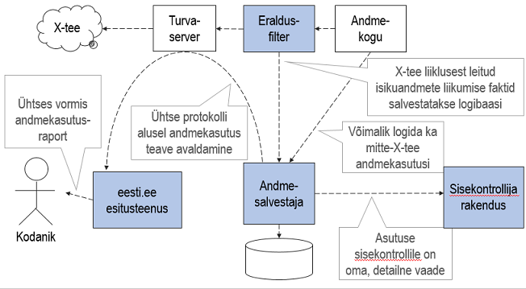

Andmejälgija / Personal Data Usage Monitor
=====================

#### Ülevaade

Andmejälgija eesmärk on pakkuda kodanikule selget ülevaadet tema andmetega sooritatud toimingutest, kuvades tervikliku ülevaate portaalis eesti.ee. 

RIA pakub andmekogu omanikule paindlikud standardkomponendid lahenduse tehniliseks teostuseks, võimaldades logida nii X-tee liiklust kui asutusesiseseid päringuid. Andmejälgija loob läbipaistvuse isikuandmete töötlemisel, parandades nii kodanike informeeritust kui abistades asutusi isikuandmete päringute selgitamisel.

#### Funktsionaalsus

Andmejälgija pakub järgmisi funktsionaalsusi, ning võimaldab neist ka ainult valitute kasutamist ja teiste ignoreerimist:

* Isikuandmete edastamise ja kasutamise logimine andmejälgija oma andmebaasi: selleks kasutatakse **eraldusfiltrit** ja **andmesalvestajat**.
* X-tee teenuse kaudu kodanike päringutele vastamine eesti.ee veebilehe kaudu: nn **kodaniku vaatamisrakendus**.
* Asutuse **sisekontrollija rakenduse** REST liides ja veebiliides.

Põhjaliku info ning juhendid leiad [dokumentatsioonist](doc/README.md).

Andmejälgija on [MIT litsentsiga](LICENSE.txt) vabatarkvara.

#### EN

Personal Data Usage Monitor is a set of 4 microservice-style applications that, when combined with each other and attached to X-Road can offer citizens a comprehensive view of how his or her personal data has been used by the government.

[A brief architectural overview](https://github.com/e-gov/AJ/blob/master/preliminary/Overview.md).

Personal Data Usage Monitor software is licenced with an MIT licence.
