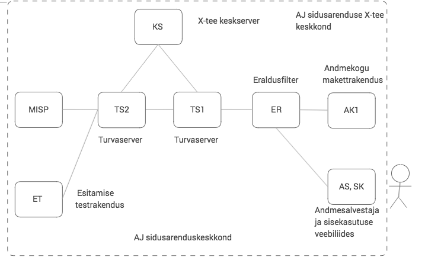

Testide paigaldamise, käivitamise ja täiendamise juhend
=======================================================


**DUMonitor**

Versioon 1.0, 09.05.2016

Tellija: Riigi Infosüsteemi Amet

Täitja: Degeetia OÜ, Mindstone OÜ


## Dokumendi ajalugu

| Versioon | Kuupäev    | Autor      | Märkused
|----------|------------|------------|----------------------------------------------
| 1.0      | 09.05.2016 | Ivo Mehide | Esimene versioon

## Sisukord

  * [Testide paigaldamine](#testide-paigaldamine)
    * [Ülevaade](#%C3%9Clevaade)
    * [Serverite häälestus](#serverite-h%C3%A4%C3%A4lestus)
      * [aj02\.ci\.kit](#aj02cikit)
      * [aj03\.ci\.kit](#aj03cikit)
      * [aj04\.ci\.kit](#aj04cikit)
      * [aj08\.ci\.kit](#aj08cikit)
      * [aj09\.ci\.kit](#aj09cikit)
      * [aj10\.ci\.kit](#aj10cikit)
      * [aj07\.ci\.kit](#aj07cikit)
    * [Jenkins häälestamine](#jenkins-h%C3%A4%C3%A4lestamine)
      * [AJ\-build](#aj-build)
      * [AJ\-deploy](#aj-deploy)
      * [AJ\-test\-integration\-\*](#aj-test-integration-)
      * [AJ\-test\-load\-\*](#aj-test-load-)
  * [Testide käivitamine](#testide-k%C3%A4ivitamine)
  * [Testide täiendamine](#testide-t%C3%A4iendamine)
    * [Ühiktestide täiendamine](#%C3%9Chiktestide-t%C3%A4iendamine)
    * [Integratsioonitestide täiendamine](#integratsioonitestide-t%C3%A4iendamine)
    * [Koormustestide täiendamine](#koormustestide-t%C3%A4iendamine)


## Testide paigaldamine

### Ülevaade

Andmejälgija testimine viiakse läbi spetsiaalses CI keskkonnas Jenkins CI kaasabil. Testimiseks on vajalikud järgmised keskkondade paigaldus:

| Komponent | Host              | Otstarve                                                      |
|-----------|-------------------|---------------------------------------------------------------|
| J         | aj-jenkins.ci.kit | Jenkins CI keskkond                                           |
| ER        | aj02.ci.kit       | Eraldusfilter                                                 |
| AS, SK    | aj03.ci.kit       | Andmesalvestaja ning andmesalvestaja sisekasutuse veebiliides |
| AK1       | aj04.ci.kit       | Test andmekogu veebiteenused                                  |
| ET        | aj05.ci.kit       | Esitaja testrakendus                                          |
| MISP      | aj07.ci.kit       | MISP (eesti.ee xforms komponendi testimiseks)                 |
| KS        | aj08.ci.kit       | X-tee keskserver                                              |
| TS2       | aj09.ci.kit       | Andmete pärija poolne X-tee turvaserver                       |
| TS1       | aj10.ci.kit       | Andmekogu poolne X-tee turvaserver                            |

Kompnentide skeem on toodud alljärgneval joonisel:




Kõik paigaldatavad serverid peavad töötama Ubuntu 14.04 LTS operatsioonisüsteemiga. 

Kõikides CI serverites on vaja tekitada kasutajatunnus "riajenk" kodukataloogi asukohaga "/opt/riajenk" ning sellele kasutajatunnusele genereerida ssh ID (kasutades sama salajase ID faili kõikides serverites). Kasutaja "riajenk" peab kuuluma neis serverites gruppi "jetty".

Server aj-jenkins.ci.kit on vaja häälestada selliselt, et selle Jenkins CI tarkvara kasutajatunnus oleks võimeline ilma paroolita SSH protokolliga logima sisse teistesse CI keskkonna serveritesse.

### Serverite häälestus

Järgnevas on toodud serverite täpsema häälestuse nõuded testide jaoks.

#### aj02.ci.kit

Kopeerida serverisse lähtekoodi kataloogis "test/ci/setup" olevad failid ning käivitada root-kasutaja õigustes seal olev skript "aj02-install.sh".

#### aj03.ci.kit

Kopeerida serverisse lähtekoodi kataloogis "test/ci/setup" olevad failid ning käivitada root-kasutaja õigustes seal olev skript "aj03-install.sh".

#### aj04.ci.kit

1. Kopeerida serverisse lähtekoodi kataloogis "test/ci/setup" olevad failid ning käivitada root-kasutaja õigustes seal olev skript "aj04-install.sh".
2. Kopeerida lähtekoodi kataloogis "test/testak" asuvad failid "testak.wsdl" ja "dumonotor.wsdl" serveri aj04.ci.kit kataloogi "/var/lib/jetty8/webapps/root".
3. Kopeerida lähtekoodi kataloogis "xforms" asuv fail "dumonitor-xforms.xhtml" serveri aj04.ci.kit kataloogi "/var/lib/jetty8/webapps/root".
4. Muuta eelmises kahes punktis kopeeritud failid kuuluma kasutajale "riajenk".

#### aj08.ci.kit

Paigaldada X-tee keskserveri tarkvara vastavalt selle paigaldamise juhendile. Tekitada selles X-tee instants nimega "CI". 

Tekitada X-tee liikmed:

* Nimi "CentralServer", liikmeklass "GOV" ja liikmekood "10000001"
* Nimi "Member 1", liikmeklass "GOV" ja liikmekood "20000001"

#### aj09.ci.kit

Paigaldada X-tee turvaserveri tarkvara vastavalt selle paigaldamise juhendile. Registreerida turvaserver X-tee liikme "CentralServer" turvaserverina.

#### aj10.ci.kit

Paigaldada X-tee turvaserveri tarkvara vastavalt selle paigaldamise juhendile. Registreerida turvaserver X-tee liikme "Member 1" turvaserverina.
Laadida turvaserverisse "Member 1" alla kaks teenuste WSDL ja lubada neis olevaid teenuseid kõigil väistel osapooltel käivitada:

* http://aj04.ci.kit:8080/testak.wsdl
* http://aj04.ci.kit:8080/dumonitor.wsdl

#### aj07.ci.kit

Paigaldada MISP2 tarkvara vastavalt selle paigaldamise juhendile (vt http://x-road.ee/misp2/docs/est/misp2_paigaldusjuhend_trusty.pdf).

Paigaldamisel tuleb jälgida, et paigaldataks variant, kus andmebaas on samas serveris.

Logida sisse MISP2 administreerimise keskkonda ja tekitada selle abil portaal alljärgnevate andmetega:

| Parameeter                      | Väärtus                                   |
|---------------------------------|-------------------------------------------|
| Portaali nimi:                  | Member 1 MISP                             |
| Portaali lühinimi:              | misp                                      |
| Portaali tüüp:                  | Asutuse portaal                           |
| Asutuse nimi:                   | Member 1                                  |
| Asutuse registrikood:           | 20000001                                  |
| X-tee protokolli versioon:      | 4.0                                       |
| X-tee instants:                 | ee-dev                                    |
| X-tee liikmeklass:              | GOV                                       |
| X-tee alamsüsteemi kood:        | AJ                                        |
| Asutuse turvaserveri aadress:   | http://aj10.ci.kit                        |
| Päringute saatmise aadress:     | http://aj04.ci.kit:8080/testak/dumonitor  |
| Arendaja vaade:                 | sees                                      |
| Saada autilogi turvaserverisse: | väljas                                    |
| Teemad kasutusel:               | väljas                                    |

Portaalile lisada administraator.

Siseneda portaali selle administraatori nimel. Lisada seal uus andmekogu andmetega:

* X-tee liikmeklass: GOV
* X-tee liikmekood: 20000001
* X-tee alamsüsteemi kood: AJ
* Andmekogu kirjeldus: Test andmekogu

Peale lisamist valida andmekogu välja ning seal:

* Sisestada andmekogu WSDL-i URL: http://aj04.ci.kit:8080/dumonitor.wsdl
* Sisestada XForms teenusekirjelduste laadimise URL: http://aj04.ci.kit:8080/dumonitor-xforms.xhtml 
* Vajutada real "Uuenda teenuste loetelu" nupule "WSDL-st"
* Linnutada checkbox "Vali kõik"  ning vajutada real "Uuenda valitud teenuste XForms kirjeldusi" nupule "Laadi URLilt".

### Jenkins häälestamine

Jenkins serveris on vaja tekitada järgmised projektid, mille konfiguratsioonid
langevad kokku alljärgnevas kirjeldatuga.

#### AJ-build

Projekti eesmärgiks on lähtekoodi kompileerimine ning ühiktestide käivitamine.

* Projekt peab laadima andmejälgija lähtekoodi Git repositooriumist "https://github.com/e-gov/AJ/".
* Lähtekoodi kompileerimine peab toimuma "Gradle Wrapper" abil taski "build" käivitamisega.
* Peale build tegemist peab projekt kävitama skripti, mille sisu on järgnev:

```sh
#!/bin/sh
cp filter/build/libs/dumonitor-filter-*.war filter/build/libs/dumonitor-filter.war
cp storage/build/libs/dumonitor-storage-*.war storage/build/libs/dumonitor-storage.war
cp query/build/libs/dumonitor-query-*.war query/build/libs/dumonitor-query.war
```

* JUnit testide XML-tulemuste asukohaks tuleb näidata "*/build/test-results/*.xml" 

#### AJ-deploy

Projekti eesmärgiks on AJ lahenduse komponentide paigaldamine CI testkeskkonda peale build tegemist.

Projektil peab olema järgmine üldhäälestus:

* Build käivitatakse peale projekti "AJ-build" stabiilse build toimumist.
* Projekt kopeerib artefaktid projektist "AJ-build" peale seda, kui selle
projekti toimunud build on toonud kaasa antud projekti buildi käivitamise. 

Projekt tuleb häälestada selliselt, et see viiks läbi järgmised tegevused:

1. Andmesalvestaja komponendi paigaldamine serverisse aj03:
   1. Kataloogi "/opt/riajenk/database" paigaldatakse andmbaasi tekitamise skriptid lähtekoodi kataloogist "storage/database".
   2. Käivitatakse skript "/opt/riajenk/database/create-testdb.sh", mis tekitab andmebaasi vajalikud objektid.
   3. Kataloogi "/usr/share/jetty8/resources" paigaldatakse konfiguratsioonifailid lähtekoodi kataloogist "test/ci/config".
   4. Kataloogi "/var/lib/jetty8/webapps" paigaldatakse build poolt tekitatud WAR fail "dumonitor-storage.war", mis
   käivitatakse automaatselt Jetty8 serveri poolt.
2. Filtri komponendi paigaldamine serverisse aj02:
   1. Kataloogi "/usr/share/jetty8/resources" paigaldatakse konfiguratsioonifailid lähtekoodi kataloogist "test/ci/config".
   2. Kataloogi "/var/lib/jetty8/webapps" paigaldatakse build käigus tekitatud WAR fail "dumonitor-filter.war", mis
   käivitatakse automaatselt Jetty8 serveri poolt.
3. Test andmekogu komponendi paigaldamine serverisse aj04:
   1. Kataloogi "/var/lib/jetty8/webapps" paigaldatakse build käigus tekitatud WAR fail "testak.war", mis
   käivitatakse automaatselt Jetty8 serveri poolt.
   2. Kataloogi "/var/lib/jetty8/webapps/root" kopeeritakse lähtekoodi kataloogist "test/testak" failid "testak.wsdl" ja "dumonitor.wsdl"
   3. Kataloogi "/var/lib/jetty8/webapps/root" kopeeritakse lähtekoodi kataloogist "xforms" fail "dumonitor-xforms.xhtml"
4. Esitamise testrakenduse komponendi paigaldamine serverisse aj05:
   1. Kataloogi "/usr/share/jetty8/resources" paigaldatakse konfiguratsioonifailid lähtekoodi kataloogist "test/ci/config".
   2. Kataloogi "/var/lib/jetty8/webapps" paigaldatakse build käigus tekitatud WAR fail "dumonitor-query.war", mis
   käivitatakse automaatselt Jetty8 serveri poolt.

#### AJ-test-integration-*

Testide jaoks tuleb tekitada projektid, mis omavad kõik ühesuguseid häälestusparameetreid, kuid millel on erinev projekti nimi ning erinev käivitatav Gradle taski nimi. Projekti nimi esitatakse kujul "AJ-test-integration-{testinimi}" ning Gradle taski nimi esitatakse kujul "jmRun_{testinimi}", kus {testinimi} on üks järgmistest:

* filterReqResp
* filterReqRespMtom
* filterReqRespInvalid
* filterLogging
* storageUrlStore
* storageRestStore
* storageRestQuery
* storageXroadQuery

Ülejäänud projekti konfiguratsioon on kõikidel projektidel ühine ning alljärgnev:

* Build käivitatakse peale projekti "AJ-build" stabiilse build toimumist.
* Projekt kopeerib artefaktid projektist "AJ-build" peale seda, kui selle
projekti toimunud build on toonud kaasa antud projekti buildi käivitamise.
* Projekt käivitab "Gradle Wrapper" abil taski "jmRun_{testinimi}".
* Peale buildi teostatavate tegevuste hulka lisatakse "Publish Performance test result report", sellele lisatakse aruanne tüübiga "JMeter" ning sellel näidatakse testide aruandefailide asukohaks "test/build/jmeter-report/*.xml"

#### AJ-test-load-*

Testide jaoks tuleb tekitada projektid, mis omavad kõik ühesuguseid häälestusparameetreid, kuid millel on erinev projekti nimi ning erinev käivitatav Gradle taski nimi. Projekti nimi esitatakse kujul "AJ-test-load-{testinimi}" ning Gradle taski nimi esitatakse kujul "jmRun_{testinimi}", kus {testinimi} on üks järgmistest:

* filterLoad
* storageRestStoreLoad
* storageRestQueryLoad
* storageXroadQueryLoad

Ülejäänud projekti konfiguratsioon on kõikidel projektidel ühine ning alljärgnev:

* Build käivitatakse peale projekti "AJ-build" stabiilse build toimumist.
* Projekt kopeerib artefaktid projektist "AJ-build" peale seda, kui selle
projekti toimunud build on toonud kaasa antud projekti buildi käivitamise.
* Projekt käivitab "Gradle Wrapper" abil taski "jmRun_{testinimi}".
* Peale buildi teostatavate tegevuste hulka lisatakse "Publish Performance test result report", sellele lisatakse aruanne tüübiga "JMeter" ning sellel näidatakse testide aruandefailide asukohaks "test/build/jmeter-report/*.xml"


## Testide käivitamine

Ühiktestid käivitatakse tarkvarakoodi kompileerimise tegevusega automaatselt, st lähtekoodi põhikataloogis käsu "./gradle build" kävitamisega. Teste on võimalik käivitada ka eraldi käsu "./gradle test" abil.

Integratsiooniteste ja koormusteste tarkarakoodikompileerimise käigus ei käivitada. Neid teste tuleb käivitada ükshaaval, andes lähtekoodi kataloogis "test" käsu:

```sh
../gradlew jmRun_{testinimi}
```

Siin {testinimi} tähistab lähtekoodi kataloogis "test/src/test/jmeter" asuva testifaili nime (ilma laiendita). Realiseeritud testide nimed on toodud dokumendis [Testilood](Testilood.md) iga testiloo kirjelduses punkti "Käivitamise ja läbiviimise skript" all.

## Testide täiendamine

### Ühiktestide täiendamine

Täiendavate ühikstestide lisamine toimub standardsel Java rakenduste jaoks kasutusel oleval meetodil. Testid lisatakse vastava mooduli "src/test" kataloogi ning need peavad vastama JUnit 4 (vt http://www.junit.org/) testide koostamise põhimõtetele. Testide käivitamiseks puudub vajadus testkonfiguratsiooni täiendada, build tuvastab automaatselt lisandunud testid ning käivitab need.

### Integratsioonitestide täiendamine

Täiendavate integratsioonitestide kirjeldamine toimub jMeter (vt http://jmeter.apache.org/) GUI tarkvara abil. Selleks tuleb arendusmasinas lähtekoodi "test" kataloogis anda käsk:

```sh
../gradlew jmGui
```

Antud käsu tulemusena käivitub jMeter GUI tarkvara. Tarkvaras tuleb kirjeldada sobiv test ning salvestada see lähtekoodi kataloogi "test/src/test/jmeter" (soovi korral saab võtta aluseks seal olevaid testifaile).

Olemasolevate testide konfiguratsiooni saab täiendavalt juhtida kataloogis "test" asuva "gradle.build" failis toodud konfiguratsiooni kaudu, selles failis toodud gradle parameetri "jmeter.jmUserProperties" kaudu. Parameeter on massiiv, mille iga element vastab jMeter tarkvara ühele parameetrile.
jMeter parameetrid tuleb seal esitada kujul "{parameeter}={väärtus}". Kasutusel on järgmised jMeter parameetrid:

| Parameeter            | Vaikeväärtus                                    | Tähendus       |
|-----------------------|-------------------------------------------------|----------------|
| testakUrl             | http://aj04.ci.kit:8080/testak/soap             | Test andmekogu URL |
| filterUrl             | http://aj02.ci.kit:8080/dumonitor-filter/testak | Filtri komponendi URL |
| dbUrl                 | jdbc:postgresql://aj03.ci.kit/aj                | Andmesalvestaja andmebaasi URL |
| dbUser                | ajuser                                          | Andmesalvestaja andmebaasi kasutajatunnus |
| dbPassword            | aj22p                                           | Andmesalvestaja andmebaasi kasutajatunnuse parool |
| storageHost           | aj03.ci.kit                                     | Andmesalvestaja serveri nimi |
| storagePort           | 8080                                            | Andmesalvestaja logimisliidese port |
| storageStorePath      | /dumonitor-storage/store                        | Andmesalvestaja REST logimisliidese URLi PATH osa |
| storageQueryPath      | /dumonitor-storage/query                        | Andmesalvestaja REST päringuliidese URLi PATH osa |
| storageXroadQueryPath | /dumonitor-storage/xroad                        | Andmesalvestaja X-tee päringuliidese URLi PATH osa |

### Koormustestide täiendamine

Koormustestide täiendamine toimub analoogselt integratsioonitestidega. Koormustestide kirjeldamisel saab kasutada täiendavalt lisaks integratsioonitestide punkt all kirjeldatule järgmisi testide juhtimise parameetreid: 

| Parameeter       | Vaikeväärtus | Tähendus       |
|------------------|--------------|----------------|
| parallelRequests | 50           | Paralleelselt käivitatavate testide arv |
| rampUpPeriod     | 10           | Sekundite arv, mille jooksul parallelsed testid käivituvad. Iga paralleelne test kävitub eelmisega võrreldes nihkega nii, et näidatud perioodi lõpuks oleks kõik paralleelsed testid käivitunud |
| loopCount        | 10           | Mitu korda järjest igat paralleelset testi käivitatakse |
| logRecordCount   | 10           | Kasutusel ainult testides "storageRestQueryLoad" ja "storageXroadQueryLoad" ning näitab, mitu logikirjet selles testis tekitatakse |

