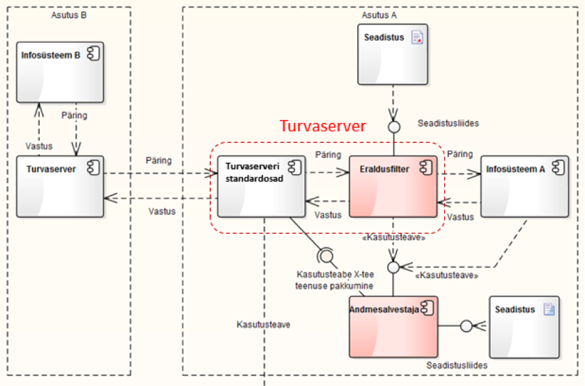
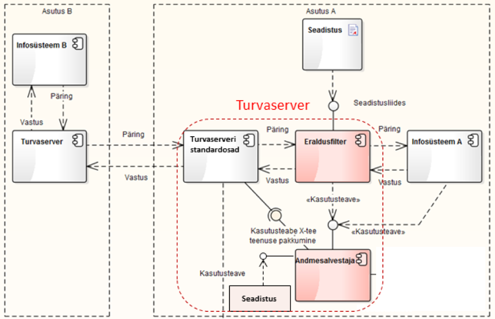
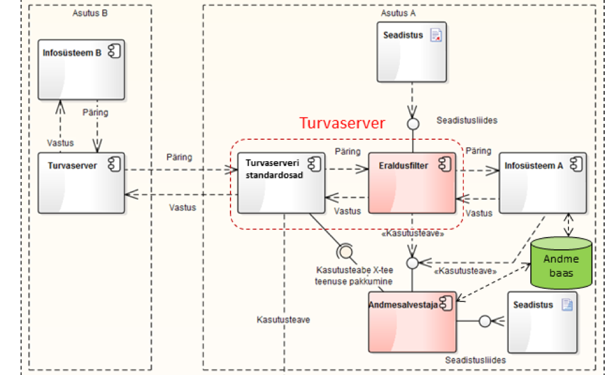
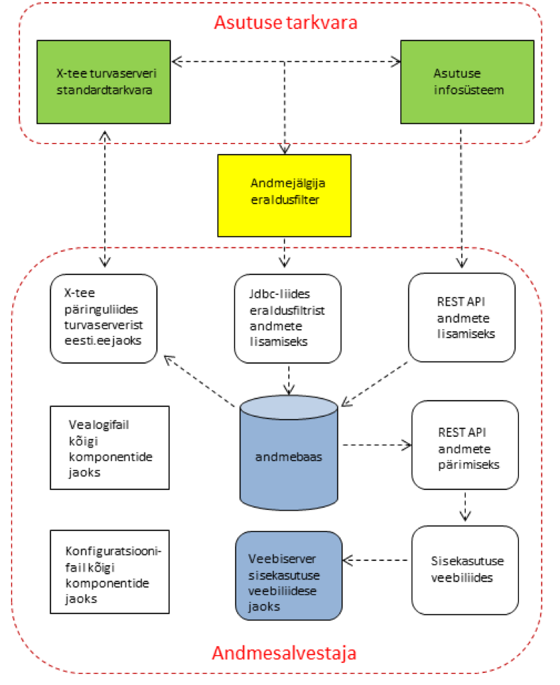

# Andmejälgija andmesalvestaja disainilahendus

X-tee andmejälgija analüüs ja disain

Versioon 1.2, 11.01.2016

Tellija: Riigi Infosüsteemi Amet

Täitja: Degeetia OÜ, Mindstone OÜ ja FocusIT OÜ

## 1. Dokumendi ajalugu

| Versioon | Kuupäev | Autor | Märkused |
| --- | --- | --- | --- |
| 1.0 | 20.12.2015 | Tanel Tammet | Esimene versioon |
| 1.1 | 30.12.2015 | Tanel Tammet | REST API juures lisatud viide teisele dokumendile |
| 1.2 | 11.01.2016 | Ivo Mehide | Punktis 9 muudetud autentimise nõuded |

## 2. Sisukord

  * [1\. Dokumendi ajalugu](#1-dokumendi-ajalugu)
  * [2\. Sisukord](#2-sisukord)
  * [3\. Sissejuhatus](#3-sissejuhatus)
  * [4\. Süsteemi taust](#4-s%C3%BCsteemi-taust)
  * [5\. Andmesalvestaja rollid andmejälgija süsteemis](#5-andmesalvestaja-rollid-andmej%C3%A4lgija-s%C3%BCsteemis)
  * [6\. Andmesalvestaja konfiguratsioonivariandid](#6-andmesalvestaja-konfiguratsioonivariandid)
  * [7\. Komponentdiagrammid](#7-komponentdiagrammid)
  * [8\. Andmekogu ja andmesalvestaja vastavus](#8-andmekogu-ja-andmesalvestaja-vastavus)
  * [9\. Andmebaas](#9-andmebaas)
  * [10\. HTTP(S) ja REST API\-d, X\-tee SOAP päringuliides ja siseveeb](#10-https-ja-rest-api-d-x-tee-soap-p%C3%A4ringuliides-ja-siseveeb)
  * [11\. Programmeerimiskeel ja teegid](#11-programmeerimiskeel-ja-teegid)

## 3. Sissejuhatus

Käesolev dokument kajastab tarkvaralise lahenduse "Andmejälgija" ühe komponendi - andmesalvestaja -  arhitektuurilist ülesehitust ja tehnilist kontseptsiooni.

Andmesalvestajas kasutatav isikuandmete andmekoosseis on toodud eraldi dokumendis "Andmejälgija isikuandmete kasutusteabe andmemudel" ja siin seda ei korrata.

Muuhulgas sisaldab dokument "Andmejälgija täiendatud tehniline kontseptsioon" hulgaliselt olulisi põhimõtteid ja detaile ka andmesalvestaja liideste jaoks, mida siin dokumendis üle ei korrata.

## 4. Süsteemi taust

Andmesalvestaja on andmejälgija süsteemi põhikomponent.

**X-tee turvaserveri all** mõistame siin dokumendis eraldi serverit / virtuaalserverit / Linuxi installatsiooni, kuhu on paigaldatud ja kus töötab X-tee turvaserveri tarkvara. Viimane sisaldab terve hulga baastarkvara ja komponente. Paigalduspaketti ennast me siin dokumendis "turvaserveriks" ei nimeta.

## 5. Andmesalvestaja rollid andmejälgija süsteemis

Andmesalvestajal kui andmejälgija põhikomponendil on mitu rolli:

- Isikuandmete kasutuse salvestamine andmebaasi.
- eesti.ee süsteemist tulevatele SOAP päringutele vastamine X-tee turvaserveri kaudu.
- REST API isikuandmete salvestamiseks.
- REST API isikuandmetest sisekasutuse jaoks päringute tegemiseks. See roll ei pruugi olla igas paigaldusviisis  kasutusel.
- Sisekasutuse veebilehtede serveerimine ja sisekasutuse jaoks autentimisvõimaluste pakkumine. See roll ei pruugi olla igas paigaldusviisis  kasutusel.
- Süsteemi põhikonfiguratsioonifaili lugemine.
- Vealogide kirjutamine.

## 6. Andmesalvestaja konfiguratsioonivariandid

Kuna andmejälgija on ette nähtud rakendamiseks paljude erinevate andmekogude ja infosüsteemide jaoks, siis nähakse ette, et teda saab kasutada mitmes erinevas konfiguratsioonis ja mitmel eri viisil paigaldatuna.

Üldpõhimõttena on andmesalvestaja ainsad kohustuslikud komponendid:

- X-tee päringuliides, mis vastab eesti.ee päringutele.
- Andmebaas, kus hoitakse isikuandmete kasutamise/edastamise fakte. Andmebaasina võib sealjuures kasutada ka infosüsteemi enda andmebaasi, mis võib mõnel juhul juba sisaldada isikuandmete kasutamise fakte mõne teistsuguse andmekoosseisuga, kui antud projekti dokumentatsioonis ette nähtud.

Kõik muud komponendid võivad jääda kasutamata.

Teiselt poolt on andmesalvestaja kõige laiem potentsiaalne kasutus selline, kus rakendatakse kõiki komponente. Kõige lihtsam on andmesalvestajat paigaldada nii, et ta paigutatakse tervikuna X-tee turvaserverisse. Selline paigaldusvariant peab olema toetatud ning see ei tohi tekitada vastuolusid andmejälgija ja X-tee turvaserveri tarkvarakomponentide või -teekide vahel.

## 7. Komponentdiagrammid

Esitame kõigepealt kolm komponentdiagrammi, mis illustreerivad erinevaid viise andmesalvestaja installeerimiseks asutuse infosüsteemi. Andmesalvestaja komponendid ei ole nendes diagrammides eraldi välja toodud.

Neljas diagramm kujutab andmesalvestaja komponente.

Esimene diagramm kujutab andmejälgijat koos andmesalvestajaga konfiguratsioonis, kus **andmesalvestaja on paigaldatud turvaserverist eraldi** ja kõik tema komponendid asuvad ühes serveris. Seejuures võib eraldusfilter olla paigaldatud kas turvaserveri sisse (nagu allpool toodud diagrammil) või turvaserverist välja, mh näiteks samasse serverisse, kus andmesalvestaja:

Teine diagramm kujutab andmejälgijat koos andmesalvestajaga konfiguratsioonis, kus **andmesalvestaja on koos eraldusfiltriga paigaldatud turvaserveri sisse** :

Kolmas diagramm kujutab andmejälgijat koos andmesalvestajaga konfiguratsioonis, kus **andmesalvestaja andmebaas on paigaldatud eraldi muudest andmesalvestaja komponentidest** või kasutatakse hoopis asutuse oma andmebaasiserverit, mitte andmesalvestaja standard-andmebaasiserverit. Eraldusfilter võib olla installeeritud nii turvaserveri sisse kui eraldi:

Neljas diagramm kujutab **andmesalvestaja enda kõiki komponente** koos nendevahelise andmete liikumisteede ja -suundadega:

## 8. Andmekogu ja andmesalvestaja vastavus

Andmesalvestajat paigaldusvariantides lähtutakse põhimõttest, et ühe andmekogu jaoks paigaldatakse üks andmesalvestaja ning andmesalvestaja paigaldust ei jagata mitme erineva andmekogu vahel.

Seda põhimõtet järgitakse ka olukorras, kus üks asutus haldab mitut andmekogu, mis näiteks jagavad asutuse enda hallata olevat turvaserverit. Viimases olukorras tuleb lähtuda eeskätt andmekogude administratiivsest eraldatusest, mitte tehnilisest: kui administratiivses mõttes moodustavad mitu erinevat serverit ühe andmekogu, siis piisab neile ühest ühisest andmesalvestajast.

Küll aga peab olema aktsepteeritav olukord, kus ühe andmesalvestajaga on seotud mitu eraldusfiltrit, mis siis kõik saadavad informatsiooni ühisesse andmesalvestajasse. See olukord tekib, kui andmekogu kasutab mitut erinevat X-tee turvaserverit.

## 9. Andmebaas

Standard-andmebaasina kasutab andmesalvestaja Postgresql-i. Seejuures nähakse ette võimalus, et andmebaasiserverina kasutatakse X-tee turvaserveri andmebaasiserverit, luues sinna eraldi andmebaas ("create database ..." mõttes) ja kasutajad ("create user ..." mõttes). Need peavad olema erinevad, kui  X-tee turvaserveri jaoks loodud andmebaasid ja kasutajad.

Andmebaasina peab süsteemi paigaldaja saama mõõduka arendustöö tulemusena kasutada ka mõnda muud andmebaasiserverit, sealhulgas andmebaasi, mis juba sisaldab andmekasutuse fakte mõnes teises formaadis. Äärmuslikul juhul võib selliseks "andmebaasiks" olla ka sobival kujul logifail.

Oma andmebaasiserveri ja andmebaasi-skeemi kergema kasutamise võimaldamiseks:

- tehakse andmebaasi-ühenduse parameetrid konfiguratsioonifaili kaudu seatavaks,
- programmeeritakse kõik andmejälgija andmebaasiliidesed eraldi failis hästi dokumenteeritud ja kergesti mõistetaval ja muudetaval kujul selliselt, et süsteemi paigaldaja saab neid mõõduka pingutusega ümber programmeerida.

Lisaks isikuandmete esitusmudelile luuakse andmebaasi ka eraldi tabeli sessiooni tokenite ehk sessiooni ID-de hoidmiseks: see on vajalik sisekasutuse süsteemis ID-kaardiga autentimise efektiivseks realiseerimiseks.   Sisekasutuse veebiliides ei ole kasutamiseks kohustuslik, seega peab andmejälgija funktsioneerima ka juhul, kui seda tabelit ei looda.

Kasutajate isikukoodide ja sessiooni tokenite halduse jaoks erivahendeid andmesalvestajasse ei looda. Neid peab süsteemi administraator saama soovi korral lisada ja muuta otse konfiguratsioonifailis või andmebaasis või käsurea-utiliitidega, mis pakutakse süsteemile kaasa.

Andmebaasi vanade kirjete arhiveerimiseks ja kustutamiseks luuakse käsurea-utiliidid, mida süsteemi administraator saab käivitada ise või cron-teenuse kaudu.

## 10. HTTP(S) ja REST API-d, X-tee SOAP päringuliides ja siseveeb

REST API-d, X-tee SOAP päringuliides ja sisekasutuse veebiliides luuakse Java SE standardteegi com.sun.net.httpserver abil või mõne analoogilise standardvahendi abil, vältimaks vajadust kasutada eraldi veebiserverit nagu Tomcat või Jetty.

Samas luuakse kõik need liidesed viisil, mis võimaldavad nende kasutamist ka Jetty või Tomcati koosseisus, mh WAR failina, mh kasutades X-tee turvaserveri komponendiks olevat Jetty serverit.

Konkreetse valiku peab saama teha konfigureerimise abil.

Tomcat või Jetty serverit andmejälgija installatsioonipaketiga kaasa ei panda.

Nii andmete lisamise kui sisekasutuse veebiliidese REST APId on detailselt täpsustatud dokumendis „Andmejälgija täiendatud tehniline kontseptsioon".

## 11. Programmeerimiskeel ja teegid

Kogu lahendus realiseeritakse Java keeles, kasutades Java Standard Editionit ja tagades süsteemi töötamise nii JSE 6, JSE 7 kui JSE 8 platvormil.

Täiendavate komponentide - mis ei ole JSE osaks – arv tuleb viia miinimumini ja nende kasutus peab olema tugevalt põhjendatud.
