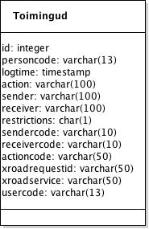

# Andmejälgija isikuandmete kasutusteabe andmemudel

X-tee andmejälgija analüüs ja disain

Versioon 1.1, 13.06.2016

Tellija: Riigi Infosüsteemi Amet

Täitja: Degeetia OÜ, Mindstone OÜ ja FocusIT OÜ

## 1. Dokumendi ajalugu

| Versioon | Kuupäev | Autor | Märkused |
| --- | --- | --- | --- |
| 1.0 | 20.12.2015 | Tanel Tammet | Esimene versioon |
| 1.1 | 13.06.2016 | Tanel Tammet | Uuendused ja täpsustused peale süsteemi valmimist 

## 2. Sisukord

  * [1\. Dokumendi ajalugu](#1-dokumendi-ajalugu)
  * [2\. Sisukord](#2-sisukord)
  * [3\. Sissejuhatus](#3-sissejuhatus)
  * [4\. ERD\-skeem](#4-erd-skeem)
  * [5\. Olemite loetelu](#5-olemite-loetelu)
    * [5\.1\. Toimingud](#51-toimingud)

## 3. Sissejuhatus

Käesolev dokument esitab tarkvaralise lahenduse "Andmejälgija" isikuandmete kasutusteabe andmemudeli kirjelduse. Andmemudeli näol on tegemist andmesalvestaja poolt sisemiselt kasutatava andmestruktuuriga. Mudel on esitatud ERD-skeemina ning toodud ära olemite kirjeldused.

## 4. ERD-skeem

## 5. Olemite loetelu

### 5.1. Toimingud

Iga kirje andmejälgijas sisaldab järgmisi välju, kusjuures eesti.ee kaudu kuvatakse neist ainult esimesed viis välja, järgmised on sisekasutuseks. Enamus välju ei ole kohustuslikud. eesti.ee jaoks kasutatav X-tee päring ei edasta välju, mis ei ole eesti.ee-s aluseks ja mida eesti.ee ei kuva.

Järgnevas toodud väljad esitatakse ingliskeelsete väljanimedena, mis on identsed nii andmebaasis kui SOAP ja REST päringutes.

Toimingute olemis hoitakse andmejälgija andmesalvestaja komponendi poolt säilitatavaid isikuandmete kasutusteabe registreeringuid. Iga isikuandmete kasutusteabe registreering esitatakse olemis ühe kirjena.

| Nimi | Andmetüüp | Kohustuslik | Kirjeldus |
| --- | --- | --- | --- |
| id | unsigned? integer | jah | Sisemine kirje numbrilist unikaalset tunnust sisaldav väli. Väärtus tekitatakse automaatselt suureneva täisarvuna. Miinimumväärtus on 1 ning maksimumväärtus 2^63 |
| personcode | varchar(13) | ei | Selle isiku isikukood, kelle andmeid töödeldi.Kui isikukood on olemas, peab ta algama riigi prefiksiga EE. Kui isikukood puudub, siis tähistab kirje masstöötluse fakti (mass-edasisaatmine, -kustutamine vms), mille sisu on kirjeldatud eraldi väljas.   Aluseks eesti.ee päringutel. |
| logtime | timestamp | jah | Isikuandmete kasutusteabe sündmuse aeg (kuupäev ja kellaaeg) sekundi täpsusega. Salvestatakse logikirje kirjutamise aeg, mitte tegelik andmete kasutamise aeg: eeldatavalt on need lähestikku. Kuvatakse eesti.ee kaudu. Aluseks eesti.ee päringutel. |
| action | varchar(100) | jah | Menetluse/tegevuse inimmõistetav nimi. Tuletatakse kas X-tee päringu nimest  ja/või on andmetöötleja poolt seatav. Võib, aga ei pruugi langeda kokku väljaga "actioncode", sisekasutuseks ettenähtud nimetusega. Kuvatakse eesti.ee kaudu. |
| sender | varchar(100) | ei | Nii asutuse kui andmekogu koond-inimmõistetav nimi / viide, kellelt andmed saadi. Kohustuslik juhul, kui logikirje vastab andmete saabumisele X-tee kaudu. Võib sisaldada klikitavat URL-i. Kuvatakse eesti.ee kaudu. |
| receiver | varchar(100) | ei | Asutuse, vajadusel täpsustava täiendusega, inimmõistetav nimi / viide, kellele andmeid edastatakse. Kohustuslik juhul, kui logikirje vastab andmete väljasaatmisele X-tee kaudu. Võib sisaldada klikitavat URL-i. Kuvatakse eesti.ee kaudu. |
| restrictions | char(1) | ei | Määrab, kas tegemist on piiratud nähtavusega kirjega. Piiratud nähtavuse korral tagastatakse see kirje ainult sellise asutuse poolt tehtavas päringus, mis on antud kirjes kas andmeid saatev asutus või andmeid küsiv asutus.Võimalikud väärtused: <ul><li>"A" – avalik, piirang puudub</li><li>"P" – piiratud, rakendub eelpool kirjeldatud piirang</li></ul> Vaikimisi väärtus  puudub, väärtuse puudumine on samaväärne väärtuse "A" esitamisega. |
| sendercode | varchar(10) | ei | Asutuse või andmekogu registrikood/sisekasutuse nimi, kellelt andmed saadi. Kohustuslik juhul, kui logikirje vastab andmete saabumisele X-tee kaudu. |
| receivercode | varchar(10) | ei | Asutuse või andmekogu registrikood/sisekasutuse nimi, kellele andmeid edastatakse. Kohustuslik juhul, kui logikirje vastab andmete väljasaatmisele X-tee kaudu. |
| actioncode | varchar(50) | ei | Menetluse/tegevuse sisekasutuseks ettenähtud nimi. Võib olla X-tee päringu nimi, andmeteenuse või andmekogu nimi vms. |
| xroadrequestid | varchar(50) | ei | X-tee päringu identifikaator. |
| xroadservice | varchar(50) | ei | Isikuandmete kasutuse päringu teenuse nimetus. |
| usercode | varchar(13) | ei | X-tee kaudu andmeid pärinud isiku või asutusesisese töötleva isiku isikukood. Väärtuse esinemisel peab algama riigi prefiksiga "EE". |

Olemil on kasutuses järgmised indeksid:

- Väli "id" omab unikaalset primaarvõtit.
- Väljade "personcode", "logtime" kombinatsiooni baasilt on moodustatud mitteunikaalne indeks.
