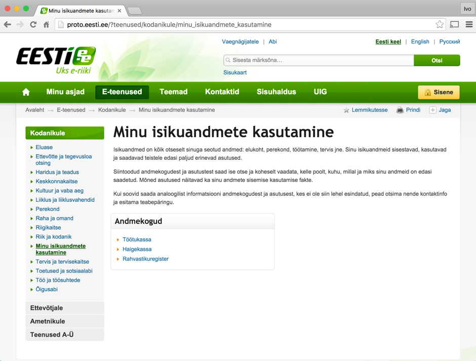
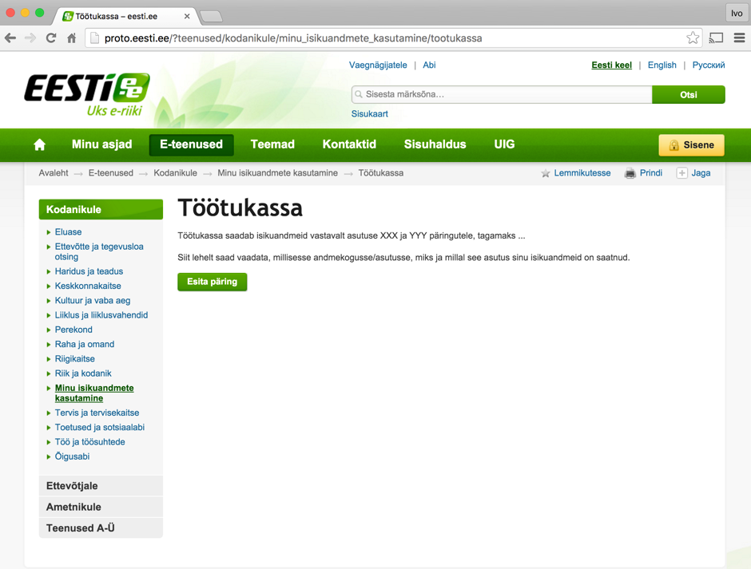

# Kasutusteabe teabeväravas eesti.ee esitamise teenuse kavand

X-tee andmejälgija analüüs ja disain

Versioon 1.2, 13.06.2016

Tellija: Riigi Infosüsteemi Amet

Täitja: Degeetia OÜ, Mindstone OÜ ja FocusIT OÜ

## 1. Dokumendi ajalugu

| Versioon | Kuupäev | Autor | Märkused |
| --- | --- | --- | --- |
| 1.0 | 20.12.2015 | Tanel Tammet | Esimene versioon |
| 1.1 | 07.12.2015 | Ivo Mehide | Muudetud peatükki 9 tellija tagasiside baasilt |
| 1.2 | 13.06.2016 | Tanel Tammet | Uuendused ja täpsustused peale süsteemi valmimist

## 2. Sisukord

  * [1\. Dokumendi ajalugu](#1-dokumendi-ajalugu)
  * [2\. Sisukord](#2-sisukord)
  * [3\. Sissejuhatus](#3-sissejuhatus)
  * [4\. Süsteemi taust](#4-s%C3%BCsteemi-taust)
  * [5\. eesti\.ee\-s kuvamise funktsionaalsus](#5-eestiee-s-kuvamise-funktsionaalsus)
  * [6\. Teenuse esileht](#6-teenuse-esileht)
  * [7\. Konkreetse asutuse otsinguvorm](#7-konkreetse-asutuse-otsinguvorm)
  * [8\. Teenuse tulemus](#8-teenuse-tulemus)
  * [9\. X\-forms prototüüp](#9-x-forms-protot%C3%BC%C3%BCp)

## 3. Sissejuhatus

Käesolev dokument kajastab andmejälgija ühe komponendi - eesti.ee portaalis isikuandmete edastamiste ja vaatamiste teenuse funktsionaalsust ja prototüüpe.

Andmejälgija kui terviku süsteemi ülevaade on esitatud dokumendis "Andmejälgija tehniline kontseptsioon".

## 4. Süsteemi taust

Ennast autentinud füüsilised isikud saavad eesti.ee portaali kaudu vaadata oma andmete edastamist ja töötlemist erinevates andmekogudes. Iga andmekogu salvestab isikuandmete töötlemise fakte eraldi oma andmesalvestajas ning annab tulemusi eesti.ee-le X-tee päringu abil, mille struktuur on kõigi andmekogude jaoks sama.

X-tee päringu formaat on toodud eraldi dokumendis "Andmejälgija kasutusteabe esitamise protokoll".

## 5. eesti.ee-s kuvamise funktsionaalsus

eesti.ee-s isikuandmete töötlemise faktide vaatamiseks läheb kasutaja kõigepealt lehele, kus

- antakse lühiülevaade teenusest;
- loetletakse asutused, kust saab andmeid küsida.

Konkreetseks andmete kuvamiseks tuleb vajutada asutuse lingile.

Peale asutuse lingile vajutamist kuvatakse:

- Lühiülevaade, mis eesmärgil asutus isikuandmeid töötleb. Tegemist on tekstiga, mida ei saadeta liidese kaudu, vaid mille edastab eesti.ee haldajale liituv asutus ise (üks kord, teenusega liitudes), lähtudes etteantud mallist. Tekstil on kolm osa:
  - ooInfosüsteemi eesmärgi paarilauseline selgitus koos viitadega infosüsteemi veebilehele (kui see on), määrusele (kui see on) ning haldavale asutusele.
  - ooKellele ja miks andmeid edasi saadetakse. Kui asutusi, kellele andmeid saadetakse, on palju (näites rahvastikuregistri puhul), ei ole vaja loetleda kõigi asutusi. Kui neid on vähe (alla viie), on soovitav neid loetleda. Kui asutus saadab välja mass-infot suure hulga isikute kohta korraga, siis see tuleks siin samuti välja tuua, koos täpsustusega, et sellistest mass-saatmistest otsinguid teha ei saa.
  - ooKas ja miks asutus ise isikuandmeid vaatab/töötleb. Siin ei ole vaja loetleda kõiki kasutusjuhte, vaid anda ainult lühike selgitus. Kui asutus otseselt ei töötle isikuandmeid, ei ole seda kirjeldusosa vaja.
- Otsivorm, kus esialgses realisatsioonis ei ole vaja sisestada ühtegi parameetrit, piisab automaatselt lisatavast isikukoodist. Algus- ja lõpukuupäev on sel juhul kohe algtäidetud, algusega üks aasta tagasi ja lõpuga käesoleva päevaga. Kuvatakse kõiki üksikuid päringuid. 

Otsinguvormile vajutamise tulemusena kuvatakse andmekogu andmesalvestajast X-tee teenuse kaudu tulnud infokirjete loend,  formaadis üks isikuandmete töötlemise kirje ühel real.

Teenuse näitelehed on esitatud proto.eesti.ee keskkonnas (Avaleht > E-teenused > Kodanikule > Minu isikuandmete kasutamine), alljärgnevas on need kirjeldatud täpsemalt.

## 6. Teenuse esileht

Esilehe struktuur sisaldab kõigepealt lühikest tekstilist ülevaadet teenusest, seejärel loetelu asutustest, kes on andmejälgija süsteemiga liitunud.

## 7. Konkreetse asutuse otsinguvorm

Asutuse lingile klikkides avaneb tekstiline ülevaade antud asutuse isikuandmete töötlemisest ja otsinguvorm.

Esialgu realiseeritakse otsinguvorm, mis on tühi, sisuliselt on kasutusel ainult kasutaja isikukood, mis tuleb vormile automaatselt.

## 8. Teenuse tulemus

Teenuse tulemuse väljanägemine on alljärgnev:

Teenuse tulemuses peab olema esitatud kolm veergu:

- **Kuupäev (**andmebaasis väli "logtime", ajamomendi väli) ehk sündmuse aeg (kuupäev ja kellaaeg)
- **Kirjeldus (**andmebaasis väli "action" **,** tekstiväli))ehk menetluse/tegevuse nimi.
- **Päringu sooritanud asutus (**andmebaasis väli "receiver", tekstiväli) ehk asutuse nimi / viide (vajadusel täpsustava täiendusega), kellele andmeid edastatakse. Võib sisaldada klikitavat viidet.

Tulemustabel ei ole sorteeritav.

## 9. X-forms prototüüp

Allpool on toodud X-formsi prototüüp eesti.ee jaoks. Prototüübi sisendina on kasutatud eraldi dokumendis "tracker.wsdl" toodud teenuse kirjeldust ning prototüüp on esitatud eraldi dokumendis "xforms.xhtml". Konkreetsete andmekogude jaoks on vajalik antud failide täiendamine andmekogu spetsiifikaga.
