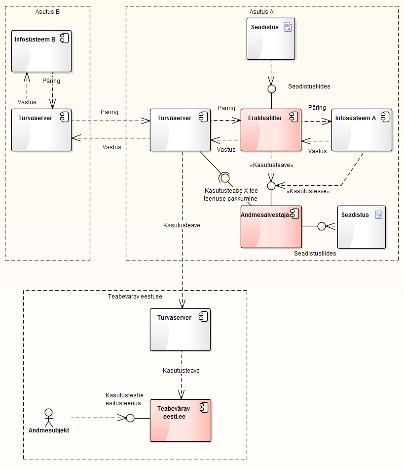

# Andmejälgija tehniline kontseptsioon

Versioon 1.2, 13.06.2016

Tellija: Riigi Infosüsteemi Amet

Täitja: Degeetia OÜ, Mindstone OÜ ja FocusIT OÜ

## 1. Dokumendi ajalugu

| Versioon | Kuupäev | Autor | Märkused |
| --- | --- | --- | --- |
| 1.0 | 20.12.2015 | Tanel Tammet | Esimene versioon |
| 1.1 | 30.12.2015 | Tanel Tammet | Lisatud REST liideste detaile ja nõutud sisekontrolli veebiliidese ID-kaardi põhine autentimine |
| 1.2 | 13.06.2016 | Tanel Tammet | Uuendused ja täpsustused peale süsteemi valmimist |

## 2. Sisukord

  * [1\. Dokumendi ajalugu](#1-dokumendi-ajalugu)
  * [2\. Sisukord](#2-sisukord)
  * [3\. Sissejuhatus](#3-sissejuhatus)
  * [4\. Süsteemi taust](#4-s%C3%BCsteemi-taust)
    * [4\.1\. Andmejälgija eesmärk](#41-andmej%C3%A4lgija-eesm%C3%A4rk)
    * [4\.2\. Andmejälgija funktsionaalsus](#42-andmej%C3%A4lgija-funktsionaalsus)
  * [5\. Komponentdiagramm](#5-komponentdiagramm)
  * [6\. Erikonfiguratsioonid juhul, kui turvaserveril ja andmekogul puudub üks\-ühene vastavus](#6-erikonfiguratsioonid-juhul-kui-turvaserveril-ja-andmekogul-puudub-%C3%BCks-%C3%BChene-vastavus)
    * [6\.1\. Üks andmekogu kasutab mitut turvaserverit](#61-%C3%9Cks-andmekogu-kasutab-mitut-turvaserverit)
    * [6\.2\. Mitu andmekogu kasutavad ühist turvaserverit](#62-mitu-andmekogu-kasutavad-%C3%BChist-turvaserverit)
  * [7\. Isikuandmete töötlemise logimine andmesalvestajasse](#7-isikuandmete-t%C3%B6%C3%B6tlemise-logimine-andmesalvestajasse)
  * [8\. Põhimõtted: mida salvestada ja mida mitte](#8-p%C3%B5him%C3%B5tted-mida-salvestada-ja-mida-mitte)
  * [9\.  Kodaniku vaatamisrakendus eesti\.ee keskkonnas\.](#9-kodaniku-vaatamisrakendus-eestiee-keskkonnas)
  * [10\. Andmekoosseis](#10-andmekoosseis)
  * [11\. Andmete lisamise REST liides](#11-andmete-lisamise-rest-liides)
  * [12\. Asutuse sisekontrollija rakendus](#12-asutuse-sisekontrollija-rakendus)
  * [13\. Sisekontrolli REST liides](#13-sisekontrolli-rest-liides)
  * [14\. Programmeerimiskeel ja teegid](#14-programmeerimiskeel-ja-teegid)
  * [15\. Konfiguratsioon](#15-konfiguratsioon)
  * [16\. Andmesalvestaja ja sellega suhtlemine](#16-andmesalvestaja-ja-sellega-suhtlemine)
  * [17\. Funktsioneerimine serverina](#17-funktsioneerimine-serverina)

## 3. Sissejuhatus

Käesolev dokument kajastab tarkvaralise lahenduse "Andmejälgija" funktsionaalsust, arhitektuurilist ülesehitust ja tehnilist kontseptsiooni, ning on sisult esialgse ülesande ja pakutud lahendusvariantide täpsustus, mitte nullist ehitatud uus kontseptsioon.

Oluline osa detailsemaid kirjeldusi on toodud eraldi dokumentides. Käesoleva dokumendi eesmärk on anda põhiülevaade süsteemi eesmärkidest, funktsionaalsusest ja arhitektuurist ning esitada kompaktselt kasutuslood.

## 4. Süsteemi taust

Andmejälgija eesmärk ja funktsionaalsused on algselt kirjeldatud SF taotluses "X-tee andmekogude isikuandmete kasutamise jälgimise rakendus" ning edaspidises jälgitakse seal toodut täiel määral.

Siin peatükis esitame nii eesmärgi kui funktsionaalsuse täpsustatud põhipunktid.

### 4.1. Andmejälgija eesmärk

Andmejälgija eesmärk on pakkuda andmekogude haldajatele paindlikud standardkomponendid isikuandmete töötlemise logimiseks ning nende faktide esitamiseks eesti.ee portaali kaudu.

Andmejälgijat saavad andmekogude haldajad kasutada mõlemat tüüpi tegevuste logimiseks:

(a) „Andmesubjekti soovil peab isikuandmete töötleja andmesubjektile teatavaks tegema kolmandad isikud, kellele tema isikuandmeid on edastatud." (IKS § 19 lg 1 p 5);

(b) „Isikuandmete töötleja on isikuandmete töötlemisel kohustatud tagama, et tagantjärele oleks võimalik kindlaks teha, millal, kelle poolt ja milliseid isikuandmeid salvestati, muudeti või kustutati või millal, kelle poolt ja millistele isikuandmetele andmetöötlussüsteemis juurdepääs saadi." (IKS § 25 lg 2 p 3)

Asutus võib soovi korral logida ka enda tehtud isikuandmete päringuid X-tee kaudu, mitte ainult X-tee kaudu väljapoole edastamisi või ametnike poolt sisemiselt kasutamisi.

Andmejälgija kasutamine või mittekasutamine ning konkreetne viis tema kasutuseks on iga andmekogu haldaja oma otsus ja valik. Mida ja kuidas konkreetselt logida, seadistab ja arendab andmekogu haldaja oma vajadustele ning eelistustele vastavalt. Selleks on andmejälgija realiseeritud viisil, mis hõlbustab tema kasutust erinevates stsenaariumides.

## 4.2. Andmejälgija funktsionaalsus

Andmejälgija pakub järgmisi funktsionaalsusi, ning võimaldab neist ka ainult valitute kasutamist ja teiste ignoreerimist:

- Isikuandmete edastamise ja kasutamise logimine andmejälgija oma andmebaasi: selleks kasutatakse eraldusfiltrit ja andmesalvestajat.
- X-tee teenuse kaudu kodanike päringutele vastamine eesti.ee veebilehe kaudu: nn kodaniku vaatamisrakendus.
- Asutuse sisekontrollija rakenduse REST liides ja veebiliides.

Vajadus asutuse sisekontrollija rakenduse järgi ilmnes kõigist intervjuudest, sh AKI soovitustest. Ilma sellise funktsionaalsuseta on (a) asutustel vähe motivatsiooni süsteem kasutusele võtta ning (b) neil tekib huvi asuda seda funktsionaalsust ise looma.

Lisaks on loodud andmejälgija kasutuse reeglistik ja suunised: milliseid isikuandmete edastamisi ja -kasutusi logida (ja kuidas logida) ning milliseid pigem mitte. Vajadus selliste suuniste järele ilmnes mitmes intervjuus, samuti soovitas seda AKI.

Kasutuslood on esitatud viie rollina eraldi dokumendis "Andmejälgija kasutuslood":  tavakasutaja eesti.ee kaudu, ametnik asutuses, sisekontroll asutuses, IT süsteemiadministraator asutuses, administraator eesti.ee-s.

## 5. Komponentdiagramm

Andmejälgija on realiseeritud viisil, et teda on võimalik paigaldada mitmes erinevas konfiguratsioonis vastavalt konkreetse andmekogu vajadustele ja selle haldaja võimalustele.

Kõigis konfiguratsioonides peab olema realiseeritud isikuandmete kasutamise logimine andmebaasi ning X-tee päring, mille kaudu eesti.ee portaalis kuvatakse konkreetse sisseloginud kasutaja isikuandmete kasutamise fakte selles andmebaasis.

Ülejäänud komponendid võivad jääda paigaldamata/kasutamata, samuti on nende puhul võimalik valida mitme realisatsioonivariandi vahel: näiteks, kas eraldusfilter paigaldada, kas ta paigaldada turvaserveri sisse või välja, kas andmesalvestajana kasutada spetsiaalselt andmejälgija jaoks installeeritud andmebaasi-serverit või andmekogus juba olemasolevat andmebaasi-serverit.

_X-tee turvaserveri all mõistame eraldi serverit  / virtuaalserverit / Linuxi installatsiooni_, kuhu on paigaldatud ja kus töötab X-tee turvaserveri tarkvara. Viimane sisaldab terve hulga baastarkvara ja komponente. Paigalduspaketti ennast me siin dokumendis "turvaserveriks" ei nimeta.

Eraldusfilter on andmejälgija komponent, mis jälgib isikuandmete saatmist X-tee kaudu ning kirjutab saatmisjuhud andmesalvestajasse.

Andmesalvestaja on andmejälgija komponent, mis sisaldab isikuandmete saatmisjuhtude tabelit ning sinna kirjutamise ja sealt lugemise liideseid.

Eraldusfiltrit saab paigaldada kahel eri moel (täpsemad komponentdiagrammid ja detailid kummagi juhu jaoks on toodud eraldi dokumendis "Eraldusfiltri disainlahendus"):

- Eraldusfilter on turvaserverist **eraldiseisev nn proxy** , millega infosüsteem liidestub ja mis suunab sõnumid edasi turvaserverile.
- Eraldusfilter on on **turvaserveri sees olev proxy** : pordid välismaailmaga on samad, mis turvaserveril seni, kuid sisemiselt suunab liiklust edasi teistele turvaserveri portidele (need saab ja tuleb sel juhul ümber konfigureerida).

Analoogiliselt saab ka andmesalvestajat paigaldada mitmel eri moel (täpsemad detailid on toodud juhu jaoks on toodud eraldi dokumendis "Andmesalvestaja disainlahendus"):

- Andmesalvestaja on tervikuna **paigaldatud turvaserverist välja**.
- Andmesalvestaja on tervikuna **paigaldatud turvaserveri sisse**. See variant sobib väiksema koormusega turvaserveri puhul olukorras, kus ei ole lihtne leida serverit, kuhu andmesalvestajat paigaldada.
- Andmesalvestaja on paigaldatud kas turvaserveri sisse või välja, kuid **andmebaasina kasutatakse eraldi andmebaasiserverit** , mis on infosüsteemis juba kasutusel. See variant nõuab väiksemaid lisa-arendusi ning võib sobida suurematele infosüsteemidele, samuti infosüsteemidele, mis juba logivad oma isikuandmete kasutusi andmebaasi ning soovivad lisaks realiseerida ainult X-tee liidese eesti.ee jaoks.

Komponentide üldpilt on alljärgnev:

_Andmesalvestaja_ on andmejälgija paigaldamisel kohustuslik komponent, mis koosneb mitmest osast:

- Andmebaas: võib olla nii andmesalvestaja oma standardosa kui ka realiseeritud andmekogu haldaja poolt.
- Andmete salvestamise liidesed: jdbc ja REST.
- Sisekontrollija rakenduse jaoks päringute REST liides.
- X-tee päringutele vastamise liides (diagrammil "Kasutusteabe X-tee teenuse pakkumine"), mõeldud eesti.ee kaudu tulnud päringutele vastamiseks.

_Sisekontrollija rakendus_ on asutusesiseste otsingute võimaldamiseks andmesalvestajast:

- Rakendus on lihtne nn single-page veebirakendus.
- Rakendus suhtleb andmesalvestajaga otsinguid võimaldava REST liidese kaudu.
- Rakenduse paigaldamine ei ole kohustuslik.
- Üldjuhul käsitleme seda rakendust andmesalvestaja osana, seega ei tooda teda skeemidel alati välja.

_Eraldusfilter_ on mõeldud isikuandmete edastamise salvestamiseks X-teel:

- üldjuhul väljaminevate isikuandmete jaoks, kuid on võimalik konfigureerida ka sissetulnud andmete salvestamist.
- Eraldusfilter  on küll andmejälgija standardkomponent, kuid tema paigaldamine andmejälgijas ei ole kohustuslik.
- Eraldusfiltri saab paigaldada proxyna nii turvaserveri sisse (väikese koormusega turvaserveritel) kui proxyna turvaserveri ja infosüsteemi vahele (suure koormusega turvaserveritel).
- Eraldusfiltri paigaldamise variandid ja detailid on toodud eraldi dokumendis "Eraldusfiltri disainlahendus".

_Teabevärava eesti.ee_ jaoks on loodud või loomisel:

- X-forms kujul päringuvorm.
- eesti.ee poolt luuakse andmejälgija üldleht, mida eesti.ee haldajad kasutavad.
- eesti.ee poolt edastatakse küsimuste vorm (dokument) andmekogu poolt andmejälgija liidestamiseks eesti.ee-ga: mis infot eesti.ee jaoks antakse.

Täiendavad komponentdiagrammid ja nende alternatiivid on toodud dokumentides "Eraldusfiltri disainlahendus" ja "Andmesalvestaja disainlahendus".

## 6. Erikonfiguratsioonid juhul, kui turvaserveril ja andmekogul puudub üks-ühene vastavus

Üldjuhul eeldame olukorda, kus üks andmekogu vahetab X-teega infot ühe konkreetse turvaserveri kaudu, ning vastupidi: üks turvaserver teenindab ainult ühte andmekogu.

Mõne infosüsteemi juures need eeldused aga ei kehti. Kirjeldame andmejälgija struktuuri juhul, kui need eeldused ei kehti.

Esimese põhimõttena paigaldatakse andmejälgija reeglina selliselt, et

-  **Andmesalvestaja komponent teenindab ainult ühte andmekogu,** kuid ühe andmesalvestaja küljes võib olla mitu eraldusfiltrit.
- Eraldusfiltri komponent **teenindab samuti ainult ühte andmekogu ja on seotud ainult ühe andmesalvestajaga,** kuid ühe X-tee turvaserveriga võib olla seotud mitu eraldusfiltrit.

### 6.1. Üks andmekogu kasutab mitut turvaserverit

Selline konfiguratsioon võib infosüsteemis olla kasutuses selleks, et jagada turvaserverite koormust.  Andmejälgija paigaldatakse sellisel juhul niimoodi, et:

- Paigaldatud on üksainus andmesalvestaja ning ta asub väljapool X-tee turvaserverit.
- Iga X-tee turvaserveriga on seotud omaette eraldusfilter (kas siis turvaserveri sees või turvaserverist väljas, infosüsteemi ja turvaserveri vahel) mis saadab informatsiooni eelmainitud andmesalvestajale.

### 6.2. Mitu andmekogu kasutavad ühist turvaserverit

Selline konfiguratsioon võib olla kasutusel juhul, kui väiksemad andmekogud/infosüsteemid ei soovi ise turvaserverit paigaldada ja hallata ning jagavad turvaserverit (mis võib olla paigaldatud näiteks teenusepakkuja majutuses) mitme infosüsteemi vahel. Teine kasutusjuhtum on olukord, kus üks asutus haldab mitut andmekogu, mis samuti jagavad asutuse enda hallata olevat turvaserverit.

Andmejälgija paigaldatakse sellisel juhul niimoodi, et:

- Iga andmekogu jaoks on paigaldatud üks, ainult selle andmekogu jaoks kasutatav andmesalvestaja, ning ta asub väljapool X-tee turvaserverit.
- Iga andmekogu jaoks on samuti paigaldatud üks, ainult selle andmekogu jaoks kasutatav eraldusfilter, ning ta asub väljapool X-tee turvaserverit.

## 7. Isikuandmete töötlemise logimine andmesalvestajasse

Andmejälgija üheks komponendiks on tema oma andmesalvestaja ehk logi. Andmesalvestajasse andmete sisestamiseks pakub andmejälgija kahte erinevat võimalust, millest andmekogu haldaja saab valida endale mugavamad:

1. Eraldusfilter X-tee turvaserveri ja asutuse infosüsteemi vahel, mis on installeeritud proxyna kas turvaserveri sisse või temast eraldi. Milliseid SOAP sõnumite välju ja kuidas logitakse, seadistatakse andmejälgija konfiguratsioonifailis X-path avaldiste ja teisendustabeli abil. Sel viisil saab andmejälgija liidestada ilma mingite otseste arendustöödeta asutuse infosüsteemis endas.
2. REST päring: kohaliku ligipääsuga veebiaadress, millele saadetakse tekstilised päringuandmeid, mis siis kirjutatakse andmebaasi. Päringu detailid on esitatud eraldi dokumendis.

## 8. Põhimõtted: mida salvestada ja mida mitte

Üldpõhimõtted on järgmised:

- Väljasaadetud sõnumid isikuandmetega tuleb logida, kui sõnumis on või vähem kui N isiku andmed. Kui korraga saadetakse välja enama kui N isiku andmeid (N võiks olla vahemikus 3-100), siis neid sündmusi logitakse eraldi märkega "mass-sõnum", mille juurde ei lisata isikukoode, ja mis on ette nähtud asutuse sisekontrolli jaoks.
- Sisemise kasutamise sündmusi logitakse põhimõttel, et kui ametnik vaatab konkreetse isiku andmeid, siis see vaatamine logitakse. Kui ametnik näeb nimekirja isikuandmetest, kus on nimekirjas näha konkreetsed isikuandmed kas otse või abstraheeritult, siis seda logitakse (iga üksiku isiku kaupa) ainult juhul, kui nimekiri on alla N isiku pikk, kus N on jällegi määratav infosüsteemi siseselt.
- Analoogiliselt sisemise kasutamisega võib logida ka X-tee kaudu sissetulnud isikuandmeid, kui see osutub otstarbekamaks, kui infosüsteemi sisese töö logimine. Jällegi lähtutakse alla-N/üle-N põhimõttest. Nimetatud logimine ei toimuks siis mitte eraldusfiltri vahendusel, vaid andmejälgija API väljakutsumise teel infosüsteemi siseselt (ehk, eeldab infosüsteemi arendust, mille vajalikkuse üle otsustab andmekogu haldaja ise).

## 9. Kodaniku vaatamisrakendus eesti.ee keskkonnas.

Ennast eesti.ee keskkonnas autentinud füüsilised isikud (kasutajad) saavad teha päringuid konkreetsele andmekogudele uurimaks iseenda andmete edastamisi ja kasutusi. Koondpäringute võimalus üle mitme andmekogu korraga eesti.ee liidese kaudu on kaalumisel.

Kasutajale kuvatakse eesti.ee keskkonnas veebileht, kus on loetletud infosüsteemid (mitte asutused), kellelt päringut saab teha. Iga sellise infosüsteemi järel on lühike tekst, mis kirjeldab ülevaatlikult,  mis tüüpi tegevusi isikuandmetega see infosüsteemi vaadata võimaldab ning mis viisil / mis kontaktilt saab esitada täiendavaid küsimusi. Veebilehte haldab eesti.ee haldaja.

Lisaks kuvatakse infosüsteemide juures:

- Mass-infosaatmised, mida infosüsteem teeb regulaarselt, stiilis "saadab regulaarselt isikuandmete suuri hulki infosüsteemile X, täitmaks ülesannet XX, infosüsteemile Y, täitmaks ülesannet YY..: neid mass-saatmisi siitkaudu otsida ei saa. " Vastava teksti edastab liidestuva infosüsteemi haldaja ise e-postiga, lähtudes etteantud mallist.
- Infosüsteemi ülesande paarilauseline selgitus koos viitadega infosüsteemi veebilehele (kui see on), määrusele (kui see on) ning haldavale asutusele. Vastava teksti edastab liidestuv infosüsteem ise, lähtudes etteantud mallist. Selgitus on puhtalt eesti.ee kasutajaliidesesse pandud tekst, mida andmekogu haldaja saadab liitumisel e-postiga. API kaudu seda automaatselt ei saadeta.

eesti.ee-s täiendavate selgituste ja mass-infosaatmiste kirjelduste osas rõhutab AKI, et kodanikud saaksid võimalikult hästi aru, kus ja miks nende isikuandmeid säilitatakse, edastatakse ja töödeldakse.

Infosüsteemile klikkides avaneb otsinguvorm, kus saab sisestada perioodi alguskuupäeva ja lõpukuupäeva ning koond/detailvaade lülitinupu. Algus- ja lõpukuupäev ning lülitinupp on kohe algtäidetud. Mõnes andmekogus võib olla realiseeritud ka ainult koond- või detailvaade.

Tulemusena kuvatakse andmekogu logist X-tee teenuse kaudu tulnud infokirjete loend.

Koondvaate valiku puhul agregeeritakse mitmed identsed lähestikku tehtud päringud üheks nähtavaks reaks, kus on samas näha tegelike agregeeritud päringute arv. Detailvaate puhul kuvatakse üksikuid päringuid.

Andmekogu X-tee teenus, mis taolisele päringule vastab, on andmejälgija osa, kuid andmekogu haldaja peab ta ise oma X-tee turvaserveriga liidestama.

Samuti on andmejälgija osa X-forms rakendus, mida eesti.ee süsteem päringu tegemisel veebiliidese genereerimiseks kasutab.

Andmejälgija ei sisalda eraldi rakendust, mis võimaldaks kasutajal otsida (a) üle konkreetse asutuse infosüsteemide oma isikuandmete kasutust (b) üle kõigi liidestatud infosüsteemide oma isikuandmete kasutust. Küll aga kaalutakse sellise rakenduse lisamist peale andmejälgija piloodi käivitamist ja kasutuskogemuste saamist. Konkreetselt on taolise rakenduse loomist soovitanud AKI.

## 10. Andmekoosseis

Andmejälgija salvestab kirjeid logipõhimõttel.  Kasutusel on ainult üks tabel, read on nummerdamata – kirjetel ei ole kas üldse kirje identifikaatorit või siis ei ole väljapool andmebaasi (päringutes ja vastustes) kasutatavat kirje identifikaatorit-  ning neid tagantjärgi ei muudeta ega kustutata. Andmejälgija andmebaas võibki olla realiseeritud nii andmebaasisüsteemi kasutades kui roteeritava logifailina.

Tabelil ei ole muutmist vältivaid kontrolle, nagu näiteks räsiahelaid. Süsteemi administraator saab soovi korral tabeli sisu muuta, kuid muutmiseks ei pakuta mingeid abivahendeid.

Andmejälgija andmemudel on toodud eraldi dokumendis "Andmejälgija isikuandmete kasutusteabe andmemudel".

Andmemudelis kirjeldatud väljadest kuvatakse eesti.ee kaudu viis välja, ülejäänud on sisekasutuseks. Enamus välju ei ole kohustuslikud. eesti.ee jaoks loodav X-tee päring ei edasta välju, mis ei ole eesti.ee-s aluseks ja mida eesti.ee ei kuva.

Järgnevas toodud väljad esitatakse ingliskeelsete väljanimedena, mis on identsed nii andmebaasis kui SOAP ja REST päringutes.

Eesti.ee-s esitatavad väljad:

-  **personcode** (tekstiväli) ehk isikukood: kelle andmeid töödeldi. Ei ole kohustuslik. Kui isikukood on olemas, peab ta algama riigi prefiksiga EE. Kui isikukood puudub, siis tähistab kirje masstöötluse fakti (mass-edasisaatmine, -kustutamine vms), mille sisu on kirjeldatud eraldi väljas.   Aluseks eesti.ee päringutel.
-  **logtime** (datetime väli) ehk sündmuse aeg (kuupäev ja kellaaeg) sekundi täpsusega. Kohustuslik. Salvestatakse – automaatselt - logikirje kirjutamise aeg, mitte tegelik andmete kasutamise aeg: eeldatavalt on need lähestikku. Kuvatakse eesti.ee kaudu. Aluseks eesti.ee päringutel.
-  **action** (tekstiväli)ehk menetluse/tegevuse inimloetav nimi. Kohustuslik. Tuletatakse kas X-tee päringu nimest  ja/või on andmetöötleja poolt seatav. Võib, aga ei pruugi langeda kokku väljaga "actioncode", sisekasutuseks ettenähtud nimetusega. Kuvatakse eesti.ee kaudu.
-  **receiver** (tekstiväli) ehk asutuse, vajadusel täpsustava täiendusega, inimloetav nimi / viide, kellele andmeid edastatakse. Kohustuslik juhul, kui logikirje vastab andmete väljasaatmisele X-tee kaudu. Võib sisaldada klikitavat linki. Kuvatakse eesti.ee kaudu.
-  **sender** (tekstiväli) ehk nii asutuse kui andmekogu koond - inimloetav nimi / viide, kellelt andmed saadi. Kohustuslik juhul, kui logikirje vastab andmete saabumisele X-tee kaudu. Võib sisaldada klikitavat linki. Kuvatakse eesti.ee kaudu.

Sisemiseks kasutuseks väljad (ei kuvata eesti.ee kaudu):

-  **id** (täisarvuline väli) ehk kirje numbriline id. Täidetakse salvestamisel automaatselt.
-  **restrictions** (char tüüpi väli) ehk piirangustaatus. Ei ole kohustuslik. Kui on täidetud ja sisu on midagi muud, kui "A" ehk avalik, siis ei kuvata kirjet eesti.ee kaudu.
-  **receivercode** (tekstiväli) ehk asutuse või andmekogu registrikood/sisekasutuse nimi, kellele andmeid edastatakse. Kohustuslik juhul, kui logikirje vastab andmete väljasaatmisele X-tee kaudu.
-  **sendercode** (tekstiväli) Asutuse või andmekogu registrikood/sisekasutuse nimi, kellelt andmed saadi. Kohustuslik juhul, kui logikirje vastab andmete saabumisele X-tee kaudu.
-  **actioncode** (tekstiväli) Menetluse/tegevuse sisekasutuseks ettenähtud nimi. Võib olla X-tee päringu nimi, andmeteenuse või andmekogu nimi vms.  Kohustuslik juhul, kui logikirje vastab andmete väljasaatmisele X-tee kaudu.
-  **xroadrequestid** (tekstiväli) ehk X-tee päringu identifikaator. Ei ole kohustuslik.
-  **usercode** (tekstiväli) X-tee kaudu andmeid pärinud isiku või asutusesisese töötleva isiku isikukood. Ei ole kohustuslik.

## 11. Andmete lisamise REST liides

Andmete lisamise REST liides on ette nähtud kirjete lisamiseks andmesalvestajasse otse infosüsteemi tarkvarast, alternatiivina turvaserveri liikluse jälgimisele. Selle kasutamine ei ole kohustuslik ja eeldab infosüsteemi arendustööd.

Ligipääs API-le tuleb piirata IP aadressiga. Kasutada tuleb kas http või https protokolli. Vastavad piirangud tuleb seada konfiguratsioonifailis.

Iga API päring lisab ühe andmerea.

REST liides paigaldatakse ja konfigureeritakse töötama URL-l, kuhu saab andmeid saata:

- GET päringuga cgi-konventsiooni järgi kodeerituna kujul _endpoint?personcode=....&...._ GET päring on mõeldud testimiseks, töös on tungivalt soovitav kasutada POST päringuid.
- POST päringuga samale lõpp-punktile cgi-kodeeringuga.
- POST päringuga Json struktuurina kujul {personcode: ...., action: .....}.

Väljanimed on needsamad, mis andmebaasis.

Millised väljad on kohustuslikud, tulenevad käesoleva dokumendi peatükis "Andmekoosseis" esitatud detailidest ja nõuetest. Igal juhul on kohustuslikud väljad action ja actioncode. Normaaljuhtudel tuleks kindlasti lisada ka personcode, receiver ja receivercode. Logtime ja id välju liideses ei esitatata, kuna need täidetakse andmebaasi salvestamisel automaatselt. Kõigis väljades on esitatud andmed tekstilised.

Millist kodeeringut (GET/POST, cgi/json) kasutati, tuvastab liides automaatselt.

Liidese kaudu saadetud andmed salvestatakse andmebaasi neid muutmata, kui välja arvata urldecoding, json decoding jms elementaarteisendused.

 Vigade korral annab liides tagasi veateate ja salvestab vea fakti logisse. Õnnestunud saatmise korral annab liides tagasi veateatest selgelt eristuva lihtvastuse.

## 12. Asutuse sisekontrollija rakendus

Andmekogu haldaval asutusel võib olla otstarbekas kasutada andmejälgija logi sisemiselt, uurides vajadusel isikuandmete edastamist ja kasutamist ametnike poolt, näiteks vastuse koostamiseks telefoni, paberkirja või e-posti kaudu tulnud päringule. Sisemise logi ja siseotsingute võimaldamise tähtsus andmejälgija süsteemis ilmnes kõigist intervjuudest.

Selleks võib asutus luua kas oma veebiliidese või kasutada andmejälgijasse ehitatud sisekontrollija rakendust. Omaenda veebiliidese loomise hõlbustamiseks pakub andmejälgija sisekontrolli REST-liidest ehk GET-parameetrite ja json väljundiga URLi, mille kaudu saab teha logis otsinguid.

Nimetatud liidese kaudu andmebaasis olevaid kirjeid muuta, lisada või kustutada ei saa.

Liidesele ligipääs tuleb andmekogu haldajal piirata asutuse sisevõrgu ja valitud IP aadressidega, pluss ID-kaardi põhise autentimisega.

Selleks, et andmekogu haldaja tingimata ei peaks sel juhul ise veebiliidest realiseerima, on andmejälgijas realiseeritud sisekontrollija rakendus.

Sisekontrollija rakenduse kaudu saab otsida suvalise isikukoodi jaoks andmete edastamist ja kasutamist andmejälgija logis vabalt valitud perioodil. Samuti saab vaadata kogu valitud perioodi logi ning teha täistekstiotsinguid valitud perioodi logi erinevatest väljadest.

Sisekontrollija rakenduse kaudu andmebaasis olevaid kirjeid muuta, lisada või kustutada ei saa.

Veebiliidesele ligipääs tuleb andmekogu haldajal piirata asutuse sisevõrgu ja valitud IP aadressidega ja/või ID-kaardi põhise autentimisega.

Konkreetne viis sessiooni tokenite hoidmiseks ja lubatud kasutajate isikukoodide salvestamise valikuks jäetakse otsustamiseks realisatsiooni käigus. 

Sisekontrollija rakendus on realiseeritud staatiliste html lehtede, css-i ja javascripti kombinatsioonina nn single-page rakendusena, mis pärib andmeid eelmainitud sisekasutuse REST liidese kaudu ajaxi päringutega ning ehitab tulemusest nähtava html-i.

## 13. Sisekontrolli REST liides

Andmejälgija pakub lisaks eesti.ee-le eraldi ligipääsu konkreetse andmekoguga seotud ametnike ligipääsuks/otsinguteks sisekontrollija veebiliidese kaudu.

Sisekontrolli REST liides on ette nähtud kasutajaliideste loomiseks infosüsteemi administraatoritele ja sellega töötavatele ametnikele, võimaldamaks neil otsida logikirjeid kõigi väljade järgi. Otsingud sisaldavad alati logikirje algus- ja lõppaega ning kombinatsiooni väljasisudes esinevatest tekstidest. Otsing toimub teksti sisalduvuse järgi, erandina võib kaaluda isikukoodi järgi otsingut terve isikukoodi põhiselt: juhul, kui sisalduvuse järgi otsing osutub suure andmemahu tõttu aeglaseks.

Andmete muutmist, kustutamist ja lisamist sisekontrolli REST liides ei võimalda.

Sisekontrolli REST liidesele ligipääs tuleb süsteemi haldajal piirata asutuse sisevõrguga ning kasutada ainult HTTPS protokolli ja/või ID-kaardi põhist autentimist.

Sisekontrolli REST liides näeb ette päringute tegemist ainult GET meetodiga, kasutades CGI konventsiooni järgi kodeeritud parameetreid callback=...&token=....&startrow =....&rowcount= ...sortfield=....&sortdirection=....&starttime=...&endtime=...&personcode=...  jne, kus

- väljade järjekord ei ole oluline
- callback parameeter on tingimuslik ja ette nähtud nn. padded json-i vastuse loomiseks.
- token parameeter kujutab endast sessiooni tokenit ehk sessiooni ID-d.
- startrow on esimene kuvatav rida alates 0-st (kui ei ole esitatud, on vaikimisi 0)
- rowcount on kuvatavate ridade arv (kui ei ole esitatud, on vaikimisi 100)
- sortfield on väljanimi, mille järgi sorteeritakse (kui ei ole esitatud, on vaikimisi id)
- sortdirection on sorteerimise suund (asc või desc) (kui ei ole esitatud, on vaikimisi desc)
- starttime vastab andmerea logtime väljale (võib puududa)
- endtime vastab andmerea logtime väljale (võib puududa)
- personcode ja muud edasised väljanimed on needsamad, mis andmebaasis
- personcode ja muud väljanimed võivad päringus puududa või esineda mistahes komplektina: kui neid on mitu, peavad nad kõik olema baasis olevas tekstis sisalduvuse järgi rahuldatud (and-tingimus)

Ajalised väärtused on esitatud ISO 8601 standardile vastavalt, kohalikus ajas, sekundi täpsusega, näiteks 2007-04-05T14:30:56.

REST liidese vastus on json objekt kujul {personcode: ...., logtime: .....} mis sisaldab kõiki kirje välju nende nimede ja sellesama sisuga, mis andmebaasis, või padded kujul callback\_väärtus({...}) ümber sama struktuuri.

Kõik vastuse väljad peale id (täisarv) ja logtime (vaata ülal ajaliste väärtuste esitust) on tekstiväljad.

## 14. Programmeerimiskeel ja teegid

Kogu süsteem on realiseeritud Java keeles, kasutades Java Standard Editionit ja tagades süsteemi töötamise nii JSE 6, JSE 7 kui JSE 8 platvormil. Erandina on sisekontrollija rakendus realiseeritud javascriptis nn. single-page rakendusena.

Kasutuses olevate täiendavate komponentide - mis ei ole JSE osaks – arv on minimaalne.

Süsteem on ehitatud selliselt, et teda saab paigaldada ja kasutada kas:

- JSE sisse-ehitatud com.sun.net.httpserver funktsionaalsusega ilma eraldi "suure" veebiserverita.
- Töötamaks olemasoleva või eraldi installeeritud Jetty või Tomcat serveri all, mispuhul ta on esitatud WAR-failina.

Tomcati või jetty vms eraldi veebiserverit andmejälgija pakett ei sisalda.

## 15. Konfiguratsioon

Süsteemil on kaks erinevat konfiguratsioonifaili: põhikonfiguratsioonifail andmesalvestaja jaoks ning eraldi konfiguratsioonifail eraldusfiltri jaoks.

Süsteemi põhikonfiguratsioon seatakse ühest peatükkideks jagatud konfiguratsioonifailist, mis kasutab nimi=väärtus tüüpi süntaksit, näiteks

SERVER\_PORT=10000

THREAD\_POOL\_COUNT=3

Eraldusfiltri konfiguratsioon esitatakse eraldi XML failina, mis paigutatakse samasse serverisse, kus eraldusfilter töötab.

Eraldusfiltri konfiguratsioonifailis esitatakse kaks blokki informatsiooni:

- Informatsioon turvaserveri töötamise üldparameetrite osas, mh:
  - Andmejälgija andmebaasiga kirjutamiseks ühenduse võtmise parameetrid
  - Sissetulevate ja väljaminevate sõnumite pordid ja IP-d
- Informatsioon monitooritavate sõnumite osas
  - Milliseid sõnumeid tuleb monitoorida
  - Iga sellise monitooritava sõnumitüübi kohta:
    - isikukoodi olemasolu / puudumine ja XPATH tema asukoha kohta sõnumis
    - muude andmejälgijasse salvestatavate andmeväljade jaoks kas (a) fikseeritud tekst või (b) XPATH avaldis vastava identifikaatori/teksti saamiseks sõnumist koos teisendustabeliga, mis teisendab tehnilise koodi inimloetavaks tekstiks, mis on mõeldud esitamiseks eesti.ee-s.

## 16. Andmesalvestaja ja sellega suhtlemine

Andmesalvestaja andmebaasiserverina kasutatakse standardlahendusena Postgresql süsteemi.

Andmebaasimootoriga suhtlemist teostavad andmejälgijas viis funktsiooni

- ava ühendus,
- lisa kirje,
- otsi kirjeid eesti.ee jaoks,
- otsi kirjeid sisekasutuseks,
- sulge ühendus

Nende funktsioonide muutmine või ümbervahetamine, samuti andmebaasimootori väljavahetamine või olemasoleva mootori/logisüsteemi kasutuselevõtt eeldab süsteemi lähtekoodi muutmist, kuid on tehtud võimalikult lihtsaks.

Lisaks mainitud viie funktsiooni olemasolule (ja nende muutmisvõimalusele) seadistatakse andmebaasimootoriga ühendust andmejälgija konfiguratsioonifailis.

Andmejälgija tarkvara ei eeldada andmebaasimootorilt mingeid omadusi, mida näiteks logifailidena realiseeritud "andmebaasimootor" ei pruugi omada.

## 17. Funktsioneerimine serverina

Andmejälgija funktsioneerib kahe pidevalt töötava serverina, pakkudes ligipääsu erinevatelt portidelt:

- Port, millel töötab andmete salvestamise URL ehk REST teenus
- Port, mis võtab vastu muidu X-tee turvaserverile suunatava liikluse eraldusfiltri režiimis
- Port, mis suhtleb X-tee turvaserveriga eraldusfiltri režiimis
- Port, mis pakub X-tee turvaserverile eesti.ee jaoks SOAP päringule vastust
- Port, mis pakub sisekasutuseks kirjete otsingu REST teenust ja sisekontrollija rakenduse veebilehte

Andmesalvestaja ning eraldusfiltri moodulite töötamist/mittetöötamist ja kasutusel olevaid porte reguleeritakse konfiguratsioonifaili seadmisega.
